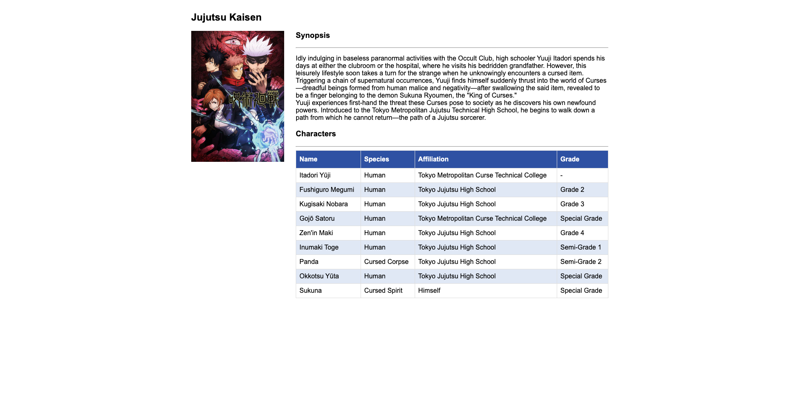

# Jujutsu Kaisen Site

## Live Coding

### Implementation technique

Siswa akan melaksanakan sesi live code di 20 menit terakhir dari sesi mentoring dan di awasi secara langsung oleh Mentor. Dengan penjelasan sebagai berikut:

-   **Durasi**: 20 menit pengerjaan
-   **Submit**: Maximum 10 menit setelah sesi mentoring menggunakan `grader-cli submit`
-   **Obligation**: Wajib melakukan _share screen_ di breakout room yang akan dibuatkan oleh Mentor pada saat mengerjakan Live Coding.

### Description

Pada sesi _live coding_ kali ini kalian diminta untuk melengkapi `code` yang sudah diberikan pada _file_ `index.html` (**tidak perlu mengerjakan CSS atau DOM**). Kalian diminta untuk membuat beberapa `element` `html` sebagai berikut:

1. Pada `div` dengan `id` berupa `anime-title` buatlah 2 buah `tag` html `h2` dengan ketentuan berikut:
    - `h2` : memiliki `id` dengan _value_ `title` dan _value_ `element` berupa `Jujutsu Kaisen`.
2. Pada `div` dengan `class` berupa `left` buatlah `tag` `html` `img` dengan `src` mengarah pada file `jujutsu-kaisen.jpeg` dalam folder _assets_ dan `alt` dengan _value_ `jujutsu-kaisen`.
3. Pada `div` dengan `class` berupa `right` buatlah 2 buah `tag` `html` `section` dengan masing-masing memiliki `id` berupa `synopsis` dan `characters` dengan ketentuan berikut:

    - `synopsis` : merupakan sebuah _section_ yang berisikan _synopsis_ dari series `Jujutsu Kaisen`. _Section_ ini memiliki beberapa _child element_ diantaranya:

        - `h3` : merupakan _element header_ dari _synopsis_ dengan value `Synopsis`.
        - `hr` (_optional_)
        - `p` : merupakan _element paragraph_ dari _synopsis_ dengan _value_ berikut:

            ```txt
            Idly indulging in baseless paranormal activities with the Occult Club, high schooler Yuuji Itadori spends his days at either the clubroom or the hospital, where he visits his bedridden grandfather. However, this leisurely lifestyle soon takes a turn for the strange when he unknowingly encounters a cursed item. Triggering a chain of supernatural occurrences, Yuuji finds himself suddenly thrust into the world of Curses—dreadful beings formed from human malice and negativity—after swallowing the said item, revealed to be a finger belonging to the demon Sukuna Ryoumen, the "King of Curses."

            Yuuji experiences first-hand the threat these Curses pose to society as he discovers his own newfound powers. Introduced to the Tokyo Metropolitan Jujutsu Technical High School, he begins to walk down a path from which he cannot return—the path of a Jujutsu sorcerer.
            ```

    - `characters` : merupakan sebuah _section_ yang berisikan _list_ karakter dari series `Jujutsu Kaisen`. _Section_ ini memiliki beberapa _child element_ diantaranya:
        - `h3` : merupakan _element header_ dari _characters_ dengan value `Characters`.
        - `hr` (_optional_)
        - `table`: _element table_ untuk menampilkan _list character_ dari series `Jujutsu Kaisen` yang memiliki `id` dengan _value_ `char-table`.
          Pada bagian _table head_ (`thead`) terdapat `id` dengan _value_ `table-head` dan _table headers_ dengan masing-masing _value_ berupa `Name`, `Species`, `Affiliation`, `Grade`. Sedangkan pada _table body_ (`tbody`) terdapat `id` dengan _value_ `table-body`. Isi _element_ dari _table body_ akan secara otomatis terisi dari file `main.js`.
            > notes: kalian tidak perlu merubah/menambahkan apapun yang pada file main.js

Berikut pedoman kerangka HTML yang bisa kalian jadikan acuan:

```txt
- body
    - div: anime-title
        - h2: title
    -div: anime-data
        - div: left
            - image
        - div: right
            - section: synopsis
                - h3
                - hr
                - p
            - section: characters
                - h3
                - hr
                - table: char-table
                    - thead: table-head
                        - tr
                            - th
                    - tbody: table-body
                        -tr
                            - th
```

### Constraints

-   Kerjakan hanya pada file index.html
-   Tidak perlu mengerjakan pada file style.css & main.js
-   berikan class/id sesuai yang diminta pada bagian direction diatas.

Berikut dibawah ini contoh hasil yang perlu kalian buat

# trytable
